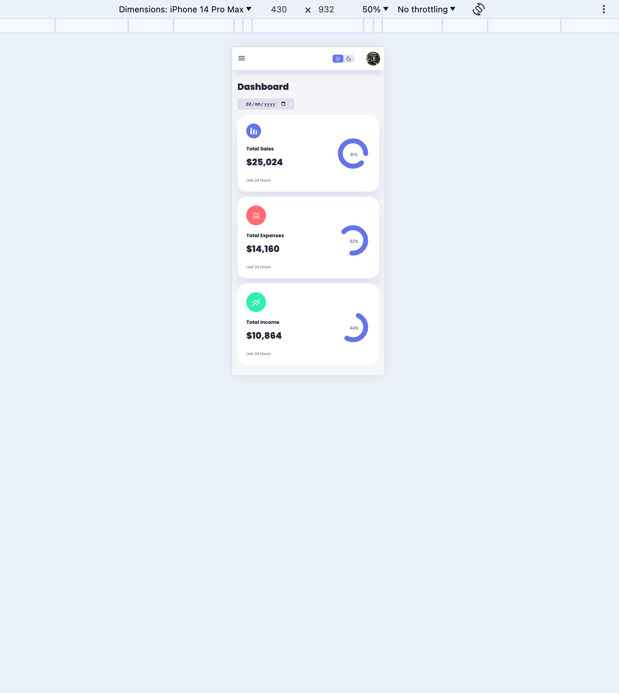

# MarketUp Dashboard

Welcome to the MarketUp Dashboard project! This project is a frontend-only eCommerce dashboard that provides an intuitive interface for managing sales, expenses, income, orders, and customer analytics. It features both dark and light mode options to enhance user experience and is fully responsive, ensuring usability across various devices.

## Table of Contents
- [Demo](#demo)
- [Features](#features)
- [Technologies Used](#technologies-used)
- [Installation](#installation)
- [Usage](#usage)
- [Screenshots](#screenshots)

## Demo
Check out the live demo of the website [here](https://mr-00-tuzki.github.io/MarketUp-Dashboard/).

## Features
- User-friendly dashboard interface
- Real-time sales, expenses, and income tracking
- Recent orders and updates section
- Sales analytics with online and offline order tracking
- Dark and light mode toggle
- Responsive design for mobile and desktop

## Technologies Used
- **Frontend**: HTML, CSS, JavaScript
- **Styling**: Tailwind CSS, Styled-components
- **Icons**: FontAwesome

## Installation
To run this project locally, follow these steps:

1. Clone the repository
    ```sh
    git clone https://github.com/mr-00-tuzki/MarketUp-Dashboard.git
    ```
2. Navigate to the project directory
    ```sh
    cd MarketUp-Dashboard
    ```
3. Install dependencies
    ```sh
    npm install
    ```
4. Start the development server
    ```sh
    npm start
    ```

## Usage
1. Visit the homepage.
2. Navigate through the dashboard to view sales, expenses, and income.
3. Check recent orders and updates.
4. Use the sales analytics section to track online and offline orders.
5. Toggle between dark and light modes using the switch at the top-right corner.
6. Experience the responsive design on various devices (mobile, tablet, desktop).

## Screenshots
### Light Mode
</img>

### Dark Mode
</img>

### Mobile View
</img>
